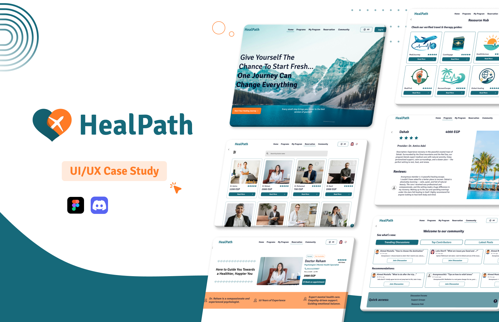

# HealPath: Therapeutic Travel Journey

  

## Team Members  
- Heba Tarek  
- Hafsa Tarek  
- Joy Hosny  
- Dana Essam  

---

## Project Overview  
Therapeutic Travel offers personalized, affordable trips with mental health support. Users access expert therapy and wellness activities. The goal is stress relief, healing, and self-discovery through travel.

---

## Resources  
**Design Link**: [Figma Design](https://www.figma.com/design/YUg1cbPdRl8MmuaiDW8nK1/Medical-Travel-web?node-id=1164-13590&t=YnFK7ZSKMmQeLgj3-1)  
**Prototype Link**: [Interactive Prototype](https://www.figma.com/proto/YUg1cbPdRl8MmuaiDW8nK1/Medical-Travel-web?page-id=0%3A1&node-id=347-1785&viewport=598%2C46%2C0.03&t=U4q7UPzygxDWBFZf-1&scaling=scale-down&content-scaling=fixed&starting-point-node-id=440%3A7015&show-proto-sidebar=1)  
**Project Drive**: [Design Assets](https://drive.google.com/drive/folders/1Gex7IGjkF2aOtqb0NWhVhIuY2k8T8l1j)
**Presentation Link**: [HealPath Presentation on Figma](https://www.figma.com/design/ZK7V1N3oiSbo6QH023xhlc/HealPath-DEPI-Presentation?node-id=0-1&t=JhzfeovE3QoNtFLb-1)
